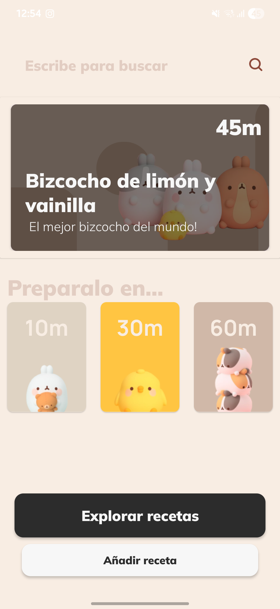
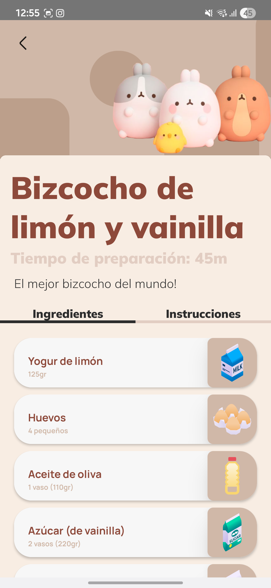
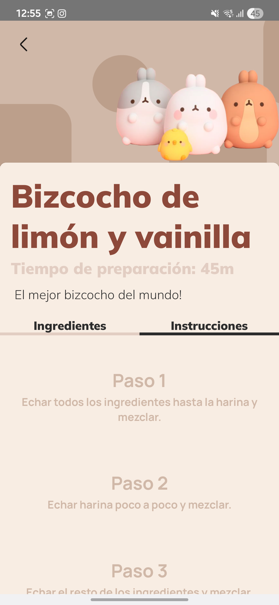
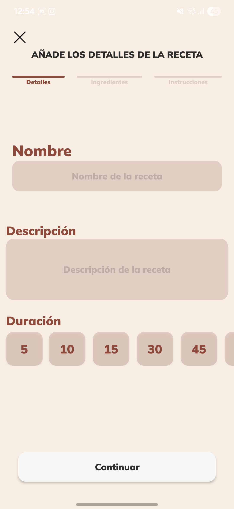

# 🍳 S-A_Book – App de Recetas

**S-A_Book** es una aplicación Android para guardar y gestionar recetas de cocina, utilizando Google Sheets como base de datos en la nube.  
> 📌 Este repositorio es **público solo para fines informativos**. El código fuente está restringido. Puedes ver capturas de pantalla más abajo y solicitar acceso si estás interesado.

---

## 📋 Descripción

Esta app permite almacenar, consultar y organizar recetas de cocina desde tu dispositivo Android. Toda la información se guarda automáticamente en una hoja de cálculo de Google Sheets, lo que facilita el acceso desde cualquier lugar y dispositivo.

---

## 🚀 Tecnologías utilizadas

- **Kotlin** – Lenguaje principal de desarrollo.
- **Android SDK** – Desarrollo de interfaz y lógica móvil.
- **Google Sheets API** – Comunicación con la hoja de cálculo online.

---

## 🧩 Características

- 📖 Añadir, editar y eliminar recetas fácilmente.  
- 🔄 Sincronización automática con Google Sheets.  
- 🎨 Interfaz limpia, intuitiva y optimizada para móviles.

---

## 📸 Capturas de pantalla

| Inicio | Ingredientes | Instrucciones | Formulario |
|--------------|--------------|--------------|--------------|
|  |  |  |  |

---

## 🔐 Acceso al código

El código fuente de esta app no es público. Si estás interesado en revisarlo por fines educativos o de colaboración, por favor, contactame solicitando acceso.

📬 **Contacto**: [alexmeca.dev@gmail.com]  

---

## 🛠 Autor

**Alex Meca Moñino**  
Proyecto personal sin soporte oficial ni distribución pública en Google Play.

---
